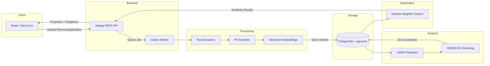
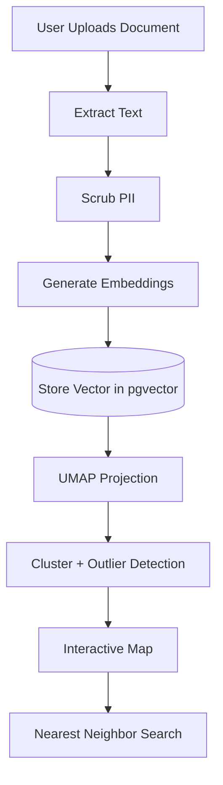

# Cohort Similarity Map


Privacy-first full-stack NLP web app that embeds resumes or applications and visualizes cohort similarity using semantic embeddings, UMAP projection, and nearest-neighbor explanations.

Built to help students understand what *actually differentiates experience* beyond skills lists.

---

## Overview

Students often believe that acquiring specific technical skills is the primary way to distinguish themselves professionally. In practice, resumes and applications tend to cluster strongly based on shared language (e.g., skills lists), while meaningful experiences and outcomes are what create separation.

Cohort Similarity Map is a web-based tool that:

- Ingests resumes or application materials (PDF / DOCX / TXT)
- Scrubs basic PII before analysis
- Generates semantic embeddings locally
- Stores vectors in Postgres using pgvector
- Projects cohort structure into 2D using UMAP
- Identifies clusters and potential outliers
- Provides nearest-neighbor explanations to show similarity patterns

The goal is not ranking individuals, but helping users understand:

> What makes applications similar — and what actually differentiates them.

---

## Features

- 📄 Document ingestion (PDF / DOCX / TXT)
- 🔒 Basic PII scrubbing (emails, phone numbers, URLs)
- 🧠 Local sentence embeddings (no external API required)
- 🗃️ Vector storage via Postgres + pgvector
- 🗺️ UMAP-based cohort projection
- 🔎 Clustering (HDBSCAN)
- 🤝 Nearest-neighbor similarity search
- 📊 Interactive scatter visualization (React + Plotly)
- ⚙️ Reproducible analysis runs with versioned parameters

---

## Architecture

```

React / Next.js Frontend
↓
Django REST API
↓
Celery Worker Queue
↓
SentenceTransformer Embeddings
↓
Postgres + pgvector
↓
UMAP Projection + Clustering

```





---

## Tech Stack

| Layer        | Technology |
|-------------|------------|
| Frontend     | Next.js / React / Plotly |
| Backend      | Django REST Framework |
| Queue        | Celery + Redis |
| Database     | PostgreSQL |
| Vector DB    | pgvector |
| NLP          | sentence-transformers |
| Projection   | UMAP |
| Clustering   | HDBSCAN |
| Deployment   | Docker Compose |

---

## Getting Started

### Requirements
- Docker
- Docker Compose

### Run locally

```bash
git clone https://github.com/<your-username>/cohort-similarity-map.git
cd cohort-similarity-map
docker compose up --build
````

Frontend:

```
http://localhost:3000/cohort
```

Backend API:

```
http://localhost:8000/api/
```

---

## Usage

1. Upload resumes or application materials
2. Assign a cohort key
3. Start an analysis run
4. Explore the 2D cohort similarity map
5. Click any point to view nearest neighbors

---

## Data Privacy

Uploaded documents may contain personally identifiable information.

This project includes:

* deterministic scrubbing of emails and phone numbers
* local embedding generation (no external API calls)
* cohort-level analysis only
* manual data deletion via cohort removal

⚠️ This tool is intended for advising and reflective use — not evaluation or ranking.

---

## Reproducibility

Each analysis run stores:

* embedding model name
* UMAP parameters
* chunking strategy version
* projection outputs
* cluster assignments

This allows comparisons across runs and parameter settings.

---

## Responsible Use

Cohort Similarity Map is designed to:

* visualize semantic similarity patterns
* highlight common language across applications
* encourage reflection on meaningful experiences

It should **not** be used to rank, score, or evaluate applicants.

---

## Roadmap

* [ ] Section-level chunking (Skills vs Experience)
* [ ] Phrase frequency analysis
* [ ] Outcome density signals
* [ ] Exportable student-facing reports
* [ ] Run comparison dashboard

---

## License

MIT License

